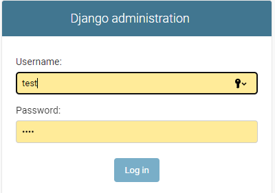
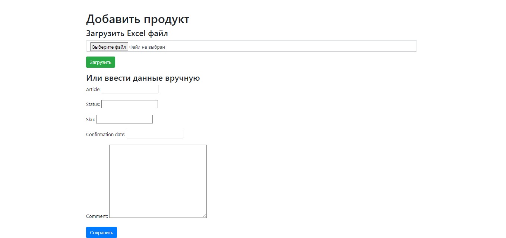
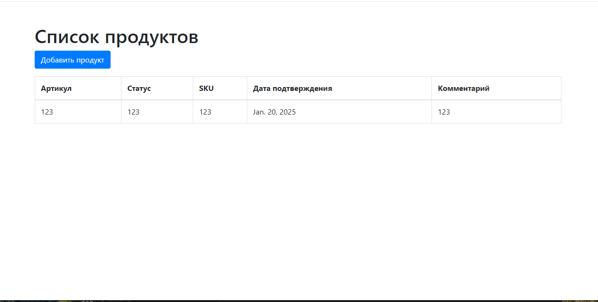

# Django Bootstrap Project

Этот проект представляет собой веб-приложение на Django, которое позволяет загружать Excel файлы и вводить данные вручную. Проект использует Docker для контейнеризации.

## Установка

### Предварительные требования

- Установленный [Docker](https://www.docker.com/get-started)
- Установленный [Docker Compose](https://docs.docker.com/compose/install/)

### Клонирование репозитория

Сначала клонируйте репозиторий:

```bash
git clone <URL_вашего_репозитория>
cd django_bootstrap_project
```
## запуск проекта

1. Соберите контейнеры

```bash
docker-compose up --build
```
2. Перейдите в браузере:
Откройте браузер и перейдите по адресу http://localhost:8000/products/ для доступа к списку продуктов.
3. Доступ к админке:
Для доступа к админке перейдите по адресу http://localhost:8000/admin/. Вам нужно будет создать суперпользователя, чтобы войти в админку. Для этого выполните команду:
```bash
docker-compose run web python manage.py createsuperuser
```
## Скриншоты


1. **Главная страница**  
     
  

2. **Страница добавления продукта**  
     
   

3. **Страница списка продуктов**  
     
   